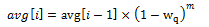

# README
学号：515030910083
姓名：王涛

## 目录
[TOC] 

## 参数推导过程
### Meter
Meter部分的参数可以通过阅读`DPDk/lib/librte_meter`库中的代码了解。
由于我们使用的是srTCM，所以只需要关注这部分的内容即可。`rte_meter.h`中定义了以下几个比较重要的数据结构：
```c
struct rte_meter_srtcm_params {
	uint64_t cir; /**< Committed Information Rate (CIR). Measured in bytes per second. */
	uint64_t cbs; /**< Committed Burst Size (CBS).  Measured in bytes. */
	uint64_t ebs; /**< Excess Burst Size (EBS).  Measured in bytes. */
};
```
在我的代码中，我给每一个流都初始化了这样一个结构，也就是说在我的代码中每一个流都会使用一组bucket来进行染色。我询问了身边的一些同学，有的是和我一样每个流用一组bucket，而有的同学是四个流共用一组bucket来进行染色。我之所以最后还是用了四组bucket是因为我考虑到如果想要控制不同的流通过的流量，可以通过调节染色过程的参数来实现，比如如果我将CBS和EBS降低，这个流就会有更多的包被染成红色。不同的染色对应稍后在`Dropper`中不同的丢包率。
但是两部分一起调节参数比较复杂，所以我虽然用了四组bucket但是配置的参数都是一样的。
这部分三个参数我直接沿用了`example`代码中的参数。取的是：
```
    param->cir = 1000000 * 46;
    param->cbs = 2048;
    param->ebs = 2048;
```
因为我没有自己配置这个参数，所以下面就简单介绍一下这三个参数对结果的影响：
* CIR：这个参数代表了路由发送数据包的速度，根据`srTCM`算法可知，数值越大发送的速度越快，这个参数增大则会有更多的包被染成绿色或者黄色；
* CBS:这个参数代表了路由的负载量，超过这个限制说明路由当前的负载量较大。增大这个参数会导致更多的包被染成绿色。
* EBS:这个参数代表了路由的最大负荷，超过这个限制路由无法承受。增大这个参数回到是更多的包被染成黄色。

### Droper
* 首先明确参数的范围
查阅`DPDK`的文档可知：

|Parameter |	Minimum |	Maximum	| Typical|
|- | :-: | -: |-: |
|Minimum Threshold |	0 |	1022 |	1/4 x queue size|
|Maximum Threshold |	1 |	1023 |	1/2 x queue size|
|Inverse Mark Probability |	1 |	255	 | 10|
|EWMA Filter Weight | 1 | 12	| 9|

* 明确参数的意义
1. 首先，Droper其实分两个阶段，第一个阶段根据queue增长的速度和queue的长度计算 `average queue size`，第二个阶段用上个阶段计算出的`average queue size`计算丢包的概率，然后决定是否将当前包丢掉。具体过程如下图所示：


2. 两个Threshold：minTh是开始丢包的节点，maxTh是丢包概率的缺陷的增长到达最大值的节点。
根据我调参过程中的经验，降低maxTh会使得流量降低，原因是大于maxTh之后丢包的概率达到最大值。
3. Inverse Mark Probability：这个是实在`Drop`阶段使用用来计算丢包率的。
> 小于minTH时


> 介于minTh和maxTh之间时

4. EWMA Filter Weight：用来计算`average queue size`。
计算公式：
> queue 为空时



> queue 非空时


* 调参过程
其实我的调参过程比较随意，我发现对minTh和maxTh调节对流量的改变粒度较小，所以我用这两个参数主要进行微调。而filter weight对流量的改变比较大，适合用于快速定位，增大weight会大幅度提升通过流量。Probability对于结果的改变好像不是很明显，所以我没有怎么使用它。另外由于这个实验模拟的是路由遇到packet burst的情况，所以大部分的包都被染成了红色，所以对红色部分参数调节结果会改变较明显。

* 实验结果
摘录三次实验结果如下，可以看到最终pass的流量四个流基本符合 8 : 4 : 2 : 1 的比例。
> 第一次
```c
################ flow 0: G Y R #################
10, 28, 256, 10
10, 128, 512, 10
12, 512, 1023, 10
################ flow 1: G Y R #################
10, 28, 256, 10
11, 128, 512, 10
12, 128, 520, 10
################ flow 2: G Y R #################
9, 28, 256, 10
9, 128, 512, 10
11, 100, 500, 10
################ flow 3: G Y R #################
9, 28, 256, 10
9, 100, 430, 10
10, 100, 430, 10


fid: 0, send: 1347047, pass: 1345154
fid: 1, send: 1316218, pass: 685431
fid: 2, send: 1381127, pass: 364202
fid: 3, send: 1343821, pass: 197126

```

> 第二次
```c
################ flow 0: G Y R #################
10, 28, 256, 10
10, 128, 512, 10
12, 512, 1023, 10
################ flow 1: G Y R #################
10, 28, 256, 10
11, 128, 512, 10
12, 128, 520, 10
################ flow 2: G Y R #################
9, 28, 256, 10
9, 128, 512, 10
11, 100, 500, 10
################ flow 3: G Y R #################
9, 28, 256, 10
9, 100, 430, 10
10, 100, 430, 10


fid: 0, send: 1592013, pass: 1588743
fid: 1, send: 1611885, pass: 785403
fid: 2, send: 1663937, pass: 434773
fid: 3, send: 1622110, pass: 211998

```

> 第三次
```c
################ flow 0: G Y R #################
10, 28, 256, 10
10, 128, 512, 10
12, 512, 1023, 10
################ flow 1: G Y R #################
10, 28, 256, 10
11, 128, 512, 10
12, 128, 520, 10
################ flow 2: G Y R #################
9, 28, 256, 10
9, 128, 512, 10
11, 100, 500, 10
################ flow 3: G Y R #################
9, 28, 256, 10
9, 100, 430, 10
10, 100, 430, 10


fid: 0, send: 1721897, pass: 1721428
fid: 1, send: 1668261, pass: 836109
fid: 2, send: 1631594, pass: 409097
fid: 3, send: 1672535, pass: 231573

```
## 所使用API介绍
### Meter
Meter部分使用了DPDK中的两个API
```c
/**
 * srTCM configuration per metered traffic flow
 *
 * @param m
 *    Pointer to pre-allocated srTCM data structure
 * @param params
 *    User parameters per srTCM metered traffic flow
 * @return
 *    0 upon success, error code otherwise
 */
int
rte_meter_srtcm_config(struct rte_meter_srtcm *m,
	struct rte_meter_srtcm_params *params);
```
这个函数是用来根据所给的配置参数初始化染色桶环境的，可以看到它接受两个参数，`m`就是返回的初始化好的染色环境。`params`是一个数据结构，里面包含了三个参数，分别是CIR，CBS 和 EBS。


```c
static inline enum rte_meter_color
rte_meter_srtcm_color_blind_check(struct rte_meter_srtcm *m,
	uint64_t time,
	uint32_t pkt_len)
```
这个函数就是用来模拟染色过程的入口，可以看到每当来了一个新的包，就将time和pkt_lenf放到染色环境中进行模拟，返回的就是给这个包染上的颜色。

### Droper
Dropper部分也使用了两个API
```c
/**
 * @brief Initialises run-time data
 *
 * @param red [in,out] data pointer to RED runtime data
 *
 * @return Operation status
 * @retval 0 success
 * @retval !0 error
 */
int
rte_red_rt_data_init(struct rte_red *red);
```
这个函数是用来初始化运行时参数的，运行时参数的数据结构如下所示：
```c
struct rte_red {
	uint32_t avg;   /**< Average queue size (avg), scaled in fixed-point format */
	uint32_t count;    /**< Number of packets since last marked packet (count) */
	uint64_t q_time;   /**< Start of the queue idle time (q_time) */
};
```
我们需要用这些参数计算下一时刻的average queue size。


```c
/**
 * @brief Decides if new packet should be enqeued or dropped
 * Updates run time data based on new queue size value.
 * Based on new queue average and RED configuration parameters
 * gives verdict whether to enqueue or drop the packet.
 *
 * @param red_cfg [in] config pointer to a RED configuration parameter structure
 * @param red [in,out] data pointer to RED runtime data
 * @param q [in] updated queue size in packets
 * @param time [in] current time stamp
 *
 * @return Operation status
 * @retval 0 enqueue the packet
 * @retval 1 drop the packet based on max threshold criteria
 * @retval 2 drop the packet based on mark probability criteria
 */
static inline int
rte_red_enqueue(const struct rte_red_config *red_cfg,
	struct rte_red *red,
	const unsigned q,
	const uint64_t time)
```
这个函数用来决定是扔掉当前包还是放入队列中，在这个函数中首先计算average queue size（分为queue为空或这queue非空两种情况），然后计算丢包概率，最后决定是否丢弃当前包。